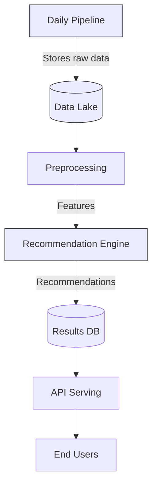
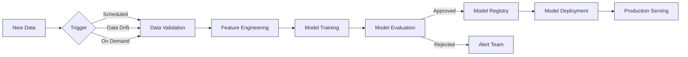

# Test Answers

## Q1 Setup the Project 
We need to clone the repository and create a python virtual environment
```bash
mkdir moovai
cd moovai
git clone https://github.com/moovai/technical-test-data-engineer.git
cd technical-test-data-engineer
git checkout -b feature/name_of_your_branch
python -m venv test_venv
source test_venv/bin/activate
pip install -r requirements.txt
```

## Q2 Develop a data flow, in Python, designed to retrieve data from the API daily

### 1. First we run the API server
```bash
cd src/moovitamix_fastapi
python -m uvicorn main:app
```
Now we can access the API documentation at: http://127.0.0.1:8000/docs

The API has three endpoints:
- `/tracks` - Available music tracks
- `/users` - User information  
- `/listen_history` - User listening history
 
### 2. Now we run the data pipeline:
```bash
python src/data_pipelines/daily_pipeline.py
```

## Q3 Run unit tests

```bash
pytest # from the project root
```

## Q4 Database schema recommendation 

I recommend a relational database schema with the following tables:

**1. tracks**
```sql
CREATE TABLE tracks (
    id INT PRIMARY KEY,
    name VARCHAR(255) NOT NULL,
    artist VARCHAR(255) NOT NULL,
    songwriters TEXT,
    duration INTERVAL NOT NULL,
    genres VARCHAR(255)[] NOT NULL,
    album VARCHAR(255),
    created_at TIMESTAMP NOT NULL,
    updated_at TIMESTAMP NOT NULL
);
```
 
**2. users**
```sql
CREATE TABLE users (
    id INT PRIMARY KEY,
    first_name VARCHAR(255) NOT NULL,
    last_name VARCHAR(255) NOT NULL,
    email VARCHAR(255) UNIQUE NOT NULL,
    gender VARCHAR(50),
    favorite_genres VARCHAR(255)[],
    created_at TIMESTAMP NOT NULL,
    updated_at TIMESTAMP NOT NULL
);
```

**3. listen_history**
```sql
CREATE TABLE listen_history (
    id SERIAL PRIMARY KEY,
    user_id INT REFERENCES users(id),
    track_id INT REFERENCES tracks(id),
    listen_time TIMESTAMP NOT NULL,
    created_at TIMESTAMP NOT NULL,
    updated_at TIMESTAMP NOT NULL
);
```


**4. recommendations (for storing generated recommendations)**
```sql
CREATE TABLE recommendations (
    id SERIAL PRIMARY KEY,
    user_id INT REFERENCES users(id),
    recommended_tracks INT[] NOT NULL,
    generation_date TIMESTAMP NOT NULL,
    expires_at TIMESTAMP NOT NULL
);
```

### My recommended Database system is PostgreSQL. 

#### Justification:

    1. Relational Nature: The data has clear relationships (users to tracks, listen history joins both)

    2. JSON Support: PostgreSQL handles array types well (for genres and track lists)

    3. Performance: Excellent for read-heavy workloads like recommendation systems

    4. Maturity: Proven reliability for production systems


## Q5 monitoring strategies for the pipeline

### Key metrics to track


    1. Data Quality Metrics:

        - Record counts per run (expected vs actual)

        - Null value percentages in critical fields

        - Data freshness (time since last successful run)

    2. Pipeline Performance Metrics:

        - Execution time per endpoint

        - API response times

        - Error rates per endpoint

    3. System Metrics:

        - Memory/CPU usage during runs

        - Disk space for stored data

        - Network latency to API

### Implementation Strategy:

    1. Logging:

        - Structured logging (JSON format) with severity levels

        - Include correlation IDs for tracking pipeline runs

    2. Monitoring Tools:

        - Elasticsearch or Prometheus + Grafana for metrics visualization

        - Sentry for error tracking

        - GCP monitoring if run in GCP

    3. Alerting:

        - Email alerts for:

            Failed pipeline runs

            Data quality anomalies

            Performance degradation

    4. Data Validation:

        - Implement Great Expectations or custom checks for:

            Referential integrity (user_ids in listen_history exist in users)

            Value ranges (durations > 0)

            Uniqueness constraints

## Q6 Recommendation Calculation Automation

### Architecture Overview



Implementation Steps:

### 1. Trigger:

    - Airflow DAG triggered after successful data ingestion

    - Alternatively: Kubernetes CronJob

### 2. Processing:

```python
def generate_recommendations():
    # 1. Load fresh data
    user_history = load_listen_history()
    tracks = load_tracks()
    
    # 2. Feature engineering
    features = create_features(user_history, tracks)
    
    # 3. Generate recommendations
    recs = model.predict(features)
    
    # 4. Store results
    save_to_db(recs)
```

### 3. Technologies:

    - Batch Processing: Spark or Dask for large datasets

    - Model Serving: MLflow or custom FastAPI endpoint

    - Orchestration: Airflow or Prefect

### 4. Scheduling:

    - Run nightly after data ingestion completes

    - Gradual rollout with canary testing

## Q7 Model Retraining Automation

### Retraining Pipeline Design



### Component Description

| Component | Purpose | Tools Example |
|-----------|---------|---------------|
| **Trigger** | Initiate retraining workflow | Airflow, Cron, MLflow |
| **Data Validation** | Verify data quality/schema | Great Expectations, Pandera |
| **Feature Engineering** | Transform raw data | Pandas, Spark, Feast |
| **Model Training** | Train new model version | Scikit-learn, TensorFlow |
| **Model Evaluation** | Compare against baseline | MLflow, Weights & Biases |
| **Model Registry** | Version control for models | MLflow, DVC |
| **Model Deployment** | Safe rollout to production | Kubernetes, SageMaker |

### Key Features
1. **Multiple Trigger Types**:
   - Scheduled (weekly/monthly)
   - On data drift detection
   - Manual on-demand triggers

2. **Quality Gates**:
   ```mermaid
   graph TD
       A[Training Complete] --> B{Accuracy > Threshold?}
       B -->|Yes| C[Register Model]
       B -->|No| D[Send Alert]
   ```

3. **Safe Deployment**:
   - Shadow mode testing
   - Canary releases
   - Automated rollback

### Sample Configuration (YAML)
```yaml
retraining:
  schedule: "0 0 * * 0"  # Weekly Sunday
  drift_threshold: 0.15
  metrics:
    - name: accuracy
      threshold: 0.85
    - name: f1_score  
      threshold: 0.80
```
